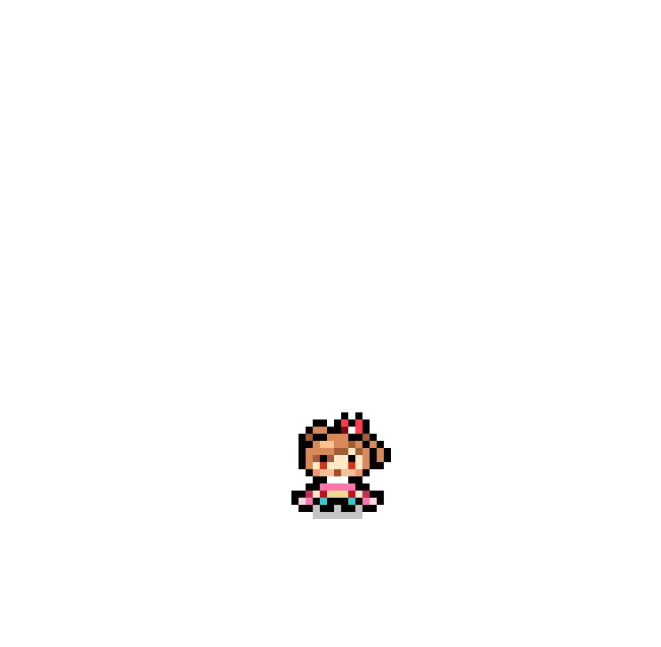

# 🚀 我的个人网站

---

## ✨ 简介

这是我的个人网站，用于展示我的作品、分享技术心得。网站目前正在持续建设中，会逐步添加更多内容。

## 🌟 特色

- 📱 响应式设计，支持手机和电脑访问
- 🎨 简洁现代的界面
- ⚡ 快速加载，优化性能

 

    

[)](https://www.zhihu.com/people/styx-q)

[)](https://space.bilibili.com/32303300)

[)](https://www.artstation.com/unimend)

